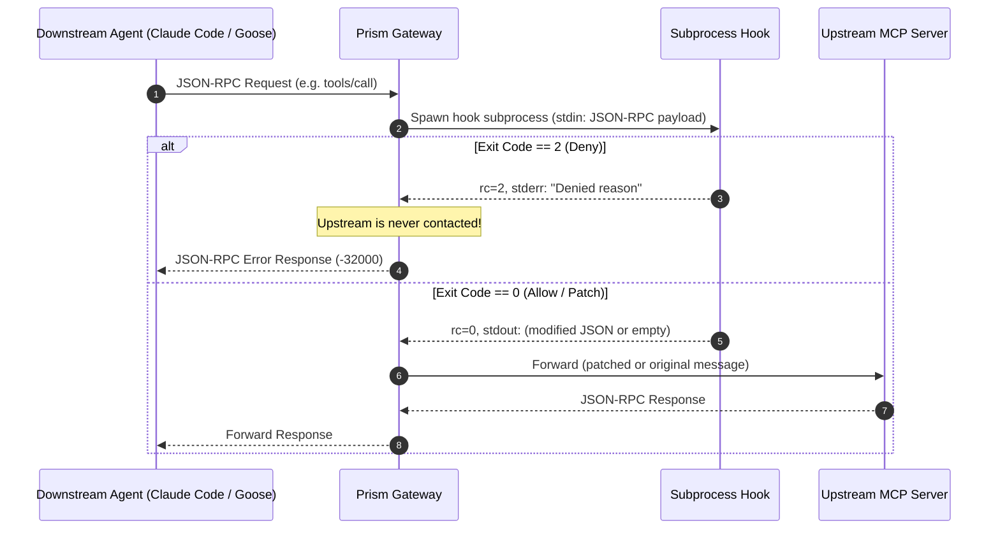

# MCP Transport Message Hooks in Prism

Prism supports low-level **MCP JSON-RPC transport message hooks** configured on a per-upstream server basis. This allows you to inspect, modify, or block raw Model Context Protocol messages exchanged between Prism and upstream servers.

---

## Overview

Unlike agent-level tool permission rules (which operate on high-level tool execution requests), transport message hooks operate directly at the **JSON-RPC 2.0 protocol layer**:
- **Covers All MCP Interactions**: Intercepts `tools/call`, `tools/list`, `initialize`, `resources/*`, `prompts/*`, and protocol notifications.
- **Per-Upstream Isolation**: Hooks are registered per server (`ServerConfig`). Servers without a hook incur zero subprocess spawns, zero latency, and zero stability risk.
- **Subprocess Filter Model**: Follows Unix filter principles—Prism pipes the raw JSON-RPC message into the hook executable's `stdin` and reads from `stdout`/`stderr`.

---

## Architecture & Message Flow

Hooks wrap the upstream transport (`ServerHookTransport`) before messages reach the server (local stdio or remote HTTP):



---

## Subprocess Protocol

### Stdin
The hook process receives the raw JSON-RPC 2.0 message on `stdin`.

Example `tools/call` request on `send`:
```json
{
  "jsonrpc": "2.0",
  "id": 1,
  "method": "tools/call",
  "params": {
    "name": "read_file",
    "arguments": {
      "path": "/workspace/project/secret.env"
    }
  }
}
```

Example `tools/list` response on `recv`:
```json
{
  "jsonrpc": "2.0",
  "id": 2,
  "result": {
    "tools": [
      {
        "name": "read_file",
        "description": "Read file contents",
        "inputSchema": { "type": "object" }
      }
    ]
  }
}
```

### Environment Variables
Each invocation provides context via environment variables:

| Variable | Description |
| :--- | :--- |
| `PRISM_SERVER_ID` | The unique ID of the upstream server. |
| `PRISM_SERVER_NAME` | The human-readable name of the server (e.g. `filesystem`). |
| `PRISM_DIRECTION` | `send` (outgoing request to server) or `recv` (incoming response from server). |
| `PRISM_METHOD` | The JSON-RPC method name (e.g. `tools/call`), if present in the message. |
| `PRISM_MESSAGE_ID` | The JSON-RPC message `id`, if present. |

### Exit Code Semantics

| Exit Code | Meaning | Action |
| :---: | :--- | :--- |
| **`0`** | **Allow / Proceed** | **Empty stdout**: The message passes through bit-for-bit.<br>**JSON stdout**: The output is parsed and replaces the JSON-RPC message. |
| **`2`** | **Deny / Block** | The request is aborted and **never sent** to the upstream server. Prism synthesizes a JSON-RPC error response (`code: -32000`) carrying the message from `stderr` (or `stdout`) back to the caller. |
| **Other / Non-zero** | **Hook Error** | Treated as an execution error. If the message had an `id`, an error response (`code: -32603`) is synthesized. |
| **Timeout** | **Killed** | If execution exceeds `timeout_secs` (default: 10s), the subprocess is killed and an error response is returned. |

---

## Configuration

### In `prism.json`
Add the `hook` object to any server definition in `~/.config/prism/prism.json` (or `%APPDATA%\prism\prism.json`):

```json
{
  "servers": [
    {
      "id": "srv-filesystem",
      "name": "filesystem",
      "command": "npx",
      "args": ["-y", "@modelcontextprotocol/server-filesystem", "/Users/alice/project"],
      "enabled": true,
      "hook": {
        "command": "/usr/local/bin/prism-filter.sh",
        "args": ["--mode=strict"],
        "direction": "both",
        "timeout_secs": 10
      }
    }
  ]
}
```

#### Hook Configuration Fields
- **`command`** *(string, required)*: Path to the executable or command (e.g. `python3`, `/path/to/filter.sh`).
- **`args`** *(array of strings, optional)*: Arguments passed to the command.
- **`direction`** *(string, optional, default: `"send"`)*:
  - `"send"`: Intercepts outgoing requests/notifications sent to the upstream server.
  - `"recv"`: Intercepts incoming responses/notifications received from the upstream server.
  - `"both"`: Intercepts traffic in both directions.
- **`timeout_secs`** *(integer, optional, default: `10`)*: Maximum execution time before the hook is killed.

### In the Desktop UI
1. Navigate to the server in Prism (click on the server row from **Servers**).
2. Scroll to the **Message Hook** section.
3. Click **+ Configure Hook** (or **Edit** on an existing hook).
4. Enter the executable path, arguments, direction, and timeout, then click **Save Hook**.
5. Prism updates the configuration and automatically restarts the upstream server so the hook activates immediately.

---

## Concrete Examples

### 1. Deny Tool Calls Targeting Forbidden Paths (Python)
Save as `guard_filter.py` and configure with `command: "python3"`, `args: ["/path/to/guard_filter.py"]`:

```python
#!/usr/bin/env python3
import sys
import json

msg = json.load(sys.stdin)

# Check if this is a tool call
if msg.get("method") == "tools/call":
    params = msg.get("params", {})
    arguments = params.get("arguments", {})
    path = str(arguments.get("path", ""))

    # Block access to sensitive directories
    if "/.ssh" in path or "/etc" in path or ".env" in path:
        sys.stderr.write(f"Access to sensitive path '{path}' is blocked by security policy.\n")
        sys.exit(2)  # rc=2 tells Prism to block the call!

# Exit 0 with empty stdout to pass the message through untouched
sys.exit(0)
```

### 2. Patch Tool Arguments on the Fly (Python)
Normalize paths or inject default options:

```python
#!/usr/bin/env python3
import sys
import json

msg = json.load(sys.stdin)

if msg.get("method") == "tools/call":
    params = msg.get("params", {})
    tool_name = params.get("name")
    
    if tool_name == "git_commit":
        # Force a commit prefix
        msg["params"]["arguments"]["message"] = "[auto-prefix] " + msg["params"]["arguments"].get("message", "")
        # Output modified JSON to stdout with rc=0
        json.dump(msg, sys.stdout)
        sys.exit(0)

# Pass through unchanged
sys.exit(0)
```

### 3. One-Liner Filter using `jq` (Bash)
Save as `filter.sh` and make executable (`chmod +x filter.sh`):

```bash
#!/bin/bash
# Read stdin
INPUT=$(cat)

# Block if path contains "private"
if echo "$INPUT" | grep -q '"path":".*private.*"'; then
    echo "Private path access denied" >&2
    exit 2
fi

# Pass through untouched
exit 0
```

### 4. Modifying Tool Schemas in `tools/list` (Incoming `recv`)
Configure with `direction: "both"` or `"recv"`:

```python
#!/usr/bin/env python3
import os
import sys
import json

direction = os.environ.get("PRISM_DIRECTION")
msg = json.load(sys.stdin)

if direction == "recv" and "result" in msg and "tools" in msg["result"]:
    # Modify tool descriptions before the agent sees them
    for tool in msg["result"]["tools"]:
        tool["description"] = f"[Verified] {tool.get('description', '')}"
    
    json.dump(msg, sys.stdout)
    sys.exit(0)

sys.exit(0)
```
